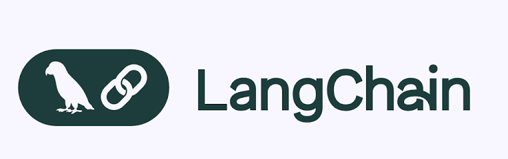

# TỔNG QUAN LANGCHAIN

[TÀI LIỆU CẦN THIẾT ĐỂ ĐỌC](https://docs.langchain.com/oss/python/langchain/overview)



## 1. LANGCHAIN LÀ GÌ

LangChain là một framework Python dùng để xây ứng dụng chạy trên nền mô hình LLM. Sản phẩm đầu ra của nó là **agent** — chương trình AI tự quyết định gọi công cụ nào, đọc kết quả trả về, rồi lặp lại cho tới khi hoàn thành mục tiêu được giao.

## 2. CÔNG THỨC CỐT LÕI CỦA LANGCHAIN
> **Agent = Model + Harness**

- **Model** — mô hình AI làm phần suy luận (GPT, Claude, Gemini...)
- **Harness** — toàn bộ phần bao quanh **hỗ trợ** model, gồm ba thứ:
  - `system_prompt`: chỉ dẫn cố định định hình vai trò và cách hành xử của agent
  - `tools`: các hàm, API, cơ sở dữ liệu mà agent được phép gọi
  - `middleware`: lớp xen giữa để can thiệp hành vi (chi tiết ở mục 4)

Hàm khởi tạo duy nhất : **`create_agent`**.

## 3. VÍ DỤ TỐI THIỂU 

```python
BEGIN

  # 1. Declare tool
  DEFINE TOOL get_weather(city)
      DESCRIPTION: "Get weather for a given city"
      RETURN "It's always sunny in " + city
  END DEFINE

  # 2. Assemble agent
  agent ← CREATE_AGENT(
      model         = "claude-sonnet-4-6"
      tools         = [ get_weather ]
      system_prompt = "You are a helpful assistant"
  )

  # 3. Run
  result ← agent.INVOKE( user_message: "What's the weather in San Francisco?" )

  # 4. Print last message
  PRINT result.messages[LAST].content_blocks

END
```

**Quy ước đọc:** 

1. `DEFINE TOOL` — khai báo một công cụ. `DESCRIPTION` là dòng agent đọc để biết công cụ dùng làm gì và khi nào nên gọi; viết mơ hồ thì agent gọi sai lúc.
2. `CREATE_AGENT` — lắp ba thứ lại: `model` (bộ não), `tools` (danh sách quyền được làm gì), `system_prompt` (chỉ dẫn cố định).
3. `INVOKE` — bấm nút chạy, đưa vào câu hỏi của người dùng.
4. `result.messages[LAST]` — kết quả trả về là **cả chuỗi tin nhắn** của toàn bộ phiên chạy, nên phải lấy phần tử cuối cùng mới là câu trả lời.

=> Ba tham số `model`, `tools`, `system_prompt` quyết định toàn bộ hành vi của agent.

## 4. ĐỊNH VỊ TRONG HỆ SINH THÁI

**LangGraph** — nền chạy. Chịu trách nhiệm lưu trạng thái của agent, chạy tiếp được sau khi gián đoạn, và dừng lại chờ người duyệt khi cần. Nó không quy định agent phải hành xử ra sao, chỉ đảm bảo mọi thứ chạy được và không mất dữ liệu giữa chừng.

**LangChain** — framework. Cung cấp vòng lặp gọi công cụ (agent nghĩ → gọi tool → đọc kết quả → lặp) và một giao diện chung để nói chuyện với mọi nhà cung cấp model. Đây là mức tối giản: chỉ có khung, không kèm tiện ích.

**Deep Agents** — bản đóng gói sẵn. Vẫn là vòng lặp đó, nhưng lắp thêm những thứ mà agent làm việc dài nào cũng cần: đọc ghi file, tự nén hội thoại khi vượt giới hạn, tự lập danh sách việc, sinh trợ lý con chạy độc lập.

**LangSmith** — công cụ quan sát. Không dùng để dựng agent. Nó ghi lại toàn bộ dấu vết một lần chạy: đã gọi công cụ nào, nhận về gì, sai ở bước nào, tốn bao nhiêu.

## 5. THUẬT NGỮ 

| Thuật ngữ | Nghĩa |
|---|---|
| **Agent** | Chương trình AI tự lặp: suy nghĩ → gọi công cụ → đọc kết quả → lặp lại |
| **Tool** | Hàm hoặc API mà agent được phép gọi |
| **Harness** | Phần khung bao quanh model: prompt, tools, middleware |
| **Middleware** | Lớp xen giữa vòng lặp để chỉnh hành vi agent |
| **Provider** | Nhà cung cấp model (OpenAI, Anthropic, Google, Ollama...) |
