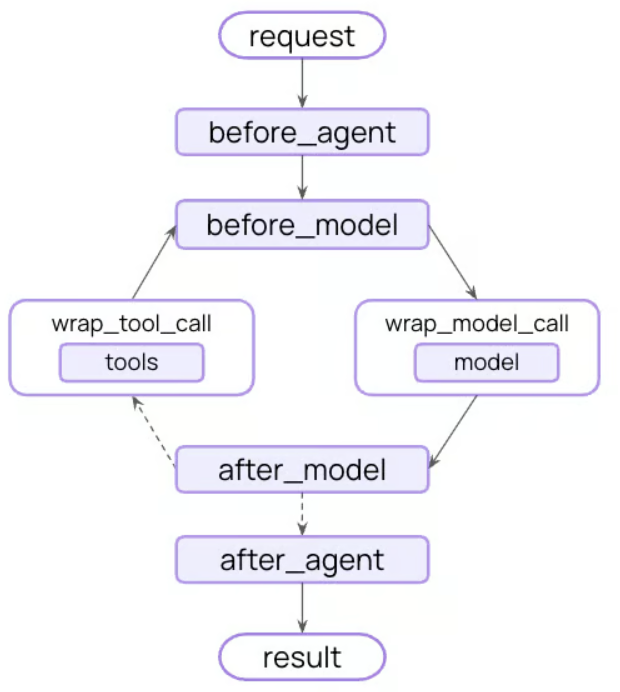

# Middleware — tổng quan (`create_agent(middleware=[...])`)

---

## 1. Tổng quan

Middleware là cơ chế can thiệp vào từng bước bên trong agent. Agent mặc định chạy một vòng lặp kín: gọi model, để model chọn tool, chạy tool, quay lại gọi model. Muốn xen vào giữa — ghi log, sửa prompt, chặn một lệnh gọi, thử lại khi lỗi, đổi model giữa chừng — thì trước đây phải tự dựng lại vòng lặp đó. Middleware là các đoạn mã gắn vào những điểm định sẵn của vòng lặp.

Gắn bằng cách truyền vào tham số `middleware` của [`create_agent`](https://reference.langchain.com/python/langchain/agents/factory/create_agent):

```python
from langchain.agents import create_agent
from langchain.agents.middleware import SummarizationMiddleware, HumanInTheLoopMiddleware

agent = create_agent(
    model="gpt-5.5",
    tools=[...],
    middleware=[                          # danh sách, thứ tự có ý nghĩa — xem 03-05 mục "Thứ tự chạy"
        SummarizationMiddleware(...),     # tóm tắt bớt hội thoại cũ khi sắp chạm trần token
        HumanInTheLoopMiddleware(...)     # dừng lại chờ người duyệt trước khi chạy tool
    ],
)
```

---

## 2. Bốn nhóm việc middleware đảm nhận

| Nhóm việc | Nội dung | Bản dựng sẵn tương ứng |
|---|---|---|
| Theo dõi hành vi agent | Ghi log, đo đạc, gỡ lỗi | Custom ->[03-05](./03-05-middleware-custom.md) |
| Biến đổi đầu vào và đầu ra | Sửa prompt, chọn tool, định dạng kết quả | [LLM tool selector](./03-04-middleware-built-in.md#9-llm-tool-selector--để-một-model-nhỏ-lọc-tool-trước) |
| Xử lý hỏng hóc và dừng sớm | Thử lại, phương án dự phòng, cắt vòng lặp | [Tool retry](./03-04-middleware-built-in.md#10-tool-retry--thử-lại-tool-hỏng), [Model fallback](./03-04-middleware-built-in.md#6-model-fallback--đổi-sang-model-khác-khi-model-chính-hỏng), [Model call limit](./03-04-middleware-built-in.md#4-model-call-limit--chặn-trần-số-lần-gọi-model) |
| Chặn và làm sạch | Giới hạn tần suất, rào chắn nội dung, phát hiện thông tin cá nhân | [PII detection](./03-04-middleware-built-in.md#7-pii-detection--phát-hiện-và-xử-lý-thông-tin-cá-nhân) |

---

## 3. Vòng lặp agent và chỗ middleware chen vào

**Khái niệm.** Vòng lặp lõi của agent gồm ba việc: gọi model, để model chọn tool để chạy, và kết thúc khi model không gọi thêm tool nào nữa. Middleware mở ra các hook — điểm móc để gắn mã — ở **trước và sau mỗi bước** trong vòng lặp đó.

<div align="center">
  
</div>

**Vai trò.** Vòng lặp chỉ có bấy nhiêu chặng — vào agent, gọi model, chạy tool, ra agent — nên tập hook của middleware cũng khép kín ở bấy nhiêu vị trí. Biết đủ chúng là biết đủ chỗ mình có thể chen vào.

Hook chỉ đứng ở **ranh giới trước/sau một chặng**, không xuyên vào bên trong chặng đó. Hai giới hạn hay gặp:

- **Không chen được giữa hai token đang chảy ra.** Model trả lời bằng cách phát ra từng mẩu chữ. `wrap_model_call` bọc quanh toàn bộ lời gọi model, không chen vào giữa mẩu thứ 3 và mẩu thứ 4 được. Muốn sửa nội dung khi nó đang stream ra người dùng thì middleware không làm được.

- **Không chen được vào thân hàm tool.** `wrap_tool_call` bọc quanh cả hàm — chặn được đầu vào, sửa được đầu ra, nhưng không đọc được biến cục bộ giữa hai dòng bên trong hàm. Muốn log giá trị trung gian thì phải sửa chính hàm tool, không phải viết middleware.

---

## 4. Chạy middleware bên trong một workflow LangGraph

**Khái niệm.** Middleware không phải một môi trường chạy riêng. Các hook chạy bên trong graph LangGraph đã dựng mà `create_agent` trả về. Nghĩa là cả agent — kèm toàn bộ middleware của nó — có thể được thả vào một [`StateGraph`](https://reference.langchain.com/python/langgraph/graph/state/StateGraph) lớn hơn với tư cách một chặng hoặc một quy trình con, và mọi hook vẫn chạy nguyên.


**Áp dụng thực tế.** Hộp thư chăm sóc khách hàng nhận thư đến từ nhiều luồng: khiếu nại, hỏi số dư, yêu cầu tất toán. Ở tầng ngoài, một graph phân loại đọc thư rồi rẽ nhánh; mỗi nhánh dẫn tới một agent chuyên trách. Mỗi agent gắn `HumanInTheLoopMiddleware`: mọi lệnh gọi `send_email` phải chờ nhân viên duyệt mới chạy.

Câu hỏi: khi agent bị nhét làm một node của graph phân loại, HITL bên trong nó có còn chạy không? Có. Agent do `create_agent` dựng ra là một subgraph hoàn chỉnh, mang theo toàn bộ middleware của mình khi được đặt vào graph khác. Quy tắc "chờ duyệt" không phụ thuộc vào việc agent đứng một mình.

**Triển khai.**

```python
from langchain.agents import AgentState, create_agent
from langchain.agents.middleware import HumanInTheLoopMiddleware
from langgraph.graph import START, StateGraph

# read_email, send_email, classify_node và route được định nghĩa ở nơi khác.
email_agent = create_agent(
    model="claude-sonnet-4-6",
    tools=[read_email, send_email],
    middleware=[HumanInTheLoopMiddleware(interrupt_on={"send_email": True})],   # chỉ chặn send_email
)

graph = (
    StateGraph(AgentState)
    .add_node("classify", classify_node)          # chặng phân loại thư đến
    .add_node("email_agent", email_agent)         # cả agent trở thành một chặng trong graph lớn
    .add_edge(START, "classify")                  # vào graph là chạy phân loại trước
    .add_conditional_edges("classify", route)     # route quyết định đi tiếp nhánh nào
    .compile()                                    # dựng xong mới chạy được
)
```

Dòng `.add_node("email_agent", email_agent)` là mấu chốt: đối số thứ hai là cả một agent đã dựng, không phải một hàm. Middleware đi kèm nó.

**!Note:** `HumanInTheLoopMiddleware` khớp theo `.name` của từng tool. Trong Python, hàm được `@tool` bọc lấy tên từ chính tên hàm — nên khóa ở ví dụ trên là `"send_email"`. Trong TypeScript, khóa khớp với `name` truyền vào `tool({...}, { name })`. Gõ sai khóa thì khóa đó không ứng với tool nào và lệnh gọi đi thẳng, không có ai duyệt; đây là suy luận từ cơ chế khớp theo tên, tài liệu không mô tả trực tiếp hành vi khi khóa sai.

Phạm vi lưu trạng thái của quy trình con (theo từng lần gọi hay theo từng thread) không nằm trên trang này — tài liệu tham khảo thêm [Use subgraphs](https://docs.langchain.com/oss/python/langgraph/use-subgraphs).

---

## 5. Nguồn tham khảo thêm 

| Trang | Nội dung |
|---|---|
| Built-in middleware | Các bản dựng sẵn cho việc thường gặp — xem [03-04](./03-04-middleware-built-in.md) |
| Custom middleware | Tự viết bằng hook và decorator — xem [03-05](./03-05-middleware-custom.md) |
| Middleware API reference | Tra cứu API đầy đủ: `https://reference.langchain.com/python/langchain/middleware/` |
| Middleware integrations | Bản riêng cho từng nhà cung cấp: Anthropic, AWS, OpenAI |
| Testing agents | Kiểm thử agent bằng LangSmith |

---

## Tham chiếu chéo

- [03-04 Middleware dựng sẵn](./03-04-middleware-built-in.md) — chi tiết 16 bản dựng sẵn được nhắc tên ở mục 2
- [03-05 Custom middleware](./03-05-middleware-custom.md) — tên và thứ tự chạy của các hook nhắc ở mục 3
- Trang gốc: `https://docs.langchain.com/oss/python/langchain/middleware/overview`