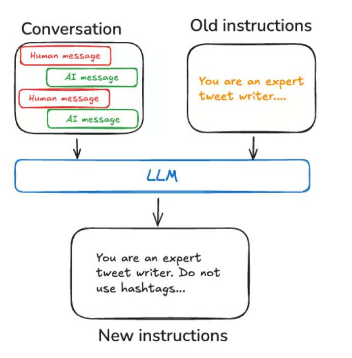

# Memory — trí nhớ của agent

> Trang khái niệm, không phải trang cài đặt. Nó trả lời "agent có mấy loại trí nhớ và mỗi loại giải quyết chuyện gì", chưa đi vào code.
> Cách làm short-term nằm ở [short-term-memory](./04-02-short-term-memory.md), cách làm long-term nằm ở [long-term-memory](./04-03-long-term-memory.md). File này chỉ nêu tên rồi trỏ sang.

---

## 1. Tổng quan

Memory là cơ chế để agent nhớ lại thông tin từ những lần tương tác trước. Không có nó, mỗi lần gọi model là một tờ giấy trắng: agent không biết người dùng vừa nói gì, không học được từ phản hồi, không giữ được sở thích người dùng qua thời gian.

Trang tài liệu chia trí nhớ thành hai loại, phân biệt bằng **phạm vi nhớ lại được** (recall scope):

| Loại | Nhớ trong phạm vi nào | Sống qua phiên khác không |
|---|---|---|
| Short-term | Một thread (một cuộc hội thoại) | Không — hết thread là hết |
| Long-term | Mọi thread, mọi phiên | Có — gọi lại bất cứ lúc nào |

Không có đoạn code tổng quan ở đây vì trang khái niệm không đưa. Code thực tế của từng loại nằm ở hai file con.

---

## 2. Short-term memory — chỉ nêu tên

**Khái niệm.** Trí nhớ gắn với một thread. Một *thread* gom nhiều lượt tương tác trong cùng một phiên, giống cách email gom các thư vào một cuộc trao đổi. LangGraph giữ short-term memory như một phần trạng thái (state) của agent, và lưu state xuống cơ sở dữ liệu qua checkpointer để thread có thể chạy tiếp bất cứ lúc nào.

**Vai trò.** Giữ mạch hội thoại đang diễn ra: lịch sử tin nhắn, file đã tải lên, tài liệu đã truy hồi, thành phẩm đã tạo. Nhờ vậy agent thấy được toàn bộ ngữ cảnh của cuộc này mà không lẫn sang cuộc khác.

Trang khái niệm dừng ở đây với short-term, phần "quản lý lịch sử tin nhắn" (cắt bớt, tóm tắt khi hội thoại quá dài so với context window) chỉ được nêu tên rồi trỏ sang hướng dẫn riêng.

→ Cơ chế đầy đủ và code: [short-term-memory](./04-02-short-term-memory.md).

---

## 3. Long-term memory — ba câu hỏi định khung

**Khái niệm.** Trí nhớ sống qua nhiều cuộc hội thoại và nhiều phiên. Khác short-term ở chỗ short-term bị bó trong một thread, còn long-term được lưu vào các *namespace* tự đặt (xem [mục 5](#5-lưu-trữ-long-term-nêu-cấu-trúc-trỏ-sang-file-triển-khai)) và gọi lại được từ thread bất kỳ.

**Vai trò.** Nhớ những thứ phải xuyên suốt: người dùng này là ai, họ thích gì, agent từng làm task này thế nào. Đây là nền để cá nhân hóa.

Long-term không có một cách làm đúng cho mọi trường hợp. Tài liệu đưa hai câu hỏi để định hướng, cộng một câu hỏi về kiểu trí nhớ:

1. **Đây là kiểu trí nhớ nào?** Con người nhớ sự kiện (facts), nhớ trải nghiệm (experiences), nhớ luật lệ (rules). Agent cũng vậy — xem [mục 4](#4-ba-kiểu-trí-nhớ).
2. **Khi nào ghi trí nhớ?** Ghi ngay trong lúc chạy ("hot path") hay ghi ở tác vụ nền ("background") — xem [mục 6](#6-hai-thời-điểm-ghi-trí-nhớ).

Ba kiểu trí nhớ được ánh xạ từ tâm lý học người sang agent :

| Kiểu | Lưu gì | Ví dụ ở người | Ví dụ ở agent |
|---|---|---|---|
| Semantic | Sự kiện | Kiến thức học ở trường | Sự kiện về một người dùng |
| Episodic | Trải nghiệm | Những việc mình đã làm | Các hành động agent từng làm |
| Procedural | Chỉ dẫn | Bản năng, kỹ năng vận động | System prompt của agent |

---

## 4. Ba kiểu trí nhớ

### 4.1 Semantic memory — nhớ sự kiện

**Khái niệm.** Lưu giữ sự kiện và khái niệm cụ thể. Ở agent, thường dùng để cá nhân hóa bằng cách nhớ các sự kiện rút ra từ những lần tương tác trước.

**Vai trò.** Cho agent chỗ dựa khi trả lời, nhờ đó câu trả lời sát người dùng hơn.

Semantic memory quản lý theo hai kiểu, khác nhau ở chỗ gom vào một chỗ hay tách ra nhiều mảnh:

**Kiểu Profile — một hồ sơ duy nhất, cập nhật liên tục.**

Trí nhớ là một "hồ sơ" gọn về một người dùng / tổ chức / thực thể (kể cả chính agent). Thực chất là một tài liệu JSON gồm các cặp khóa–giá trị mình chọn để mô tả lĩnh vực của mình. Mỗi lần nhớ thêm là phải **cập nhật lại** hồ sơ: đưa hồ sơ cũ vào, bảo model sinh ra hồ sơ mới (hoặc một bản vá JSON để đắp lên hồ sơ cũ).

Điểm yếu: hồ sơ càng to càng dễ sinh lỗi khi cập nhật. Cách gỡ mà tài liệu gợi ý là tách hồ sơ thành nhiều tài liệu, hoặc ép model giải mã theo lược đồ chặt (**strict** decoding) để schema luôn hợp lệ.

  

**Kiểu Collection — một tập tài liệu, thêm dần theo thời gian.**

Mỗi trí nhớ là một tài liệu nhỏ, phạm vi hẹp, dễ sinh. Ưu điểm: ít mất thông tin hơn, vì model chỉ cần tạo *đối tượng mới* cho thông tin mới thay vì phải dung hòa với hồ sơ cũ — nhờ vậy recall về sau cao hơn.

Cái giá của Collection nằm ở ba chỗ:

- Cập nhật phức tạp hơn: model phải tự *xóa* hoặc *sửa* mục cũ trong danh sách. Có model thiên về chèn thừa, có model thiên về sửa thừa.
- Tìm kiếm phức tạp hơn: phải tìm trong cả danh sách. `Store` hỗ trợ cả tìm theo nghĩa (semantic search) lẫn lọc theo nội dung.
- Khó dựng ngữ cảnh đầy đủ: từng mảnh trí nhớ theo một schema riêng nhưng gộp lại có thể không nắm được quan hệ giữa các mảnh, nên khi sinh câu trả lời model dễ thiếu ngữ cảnh mà kiểu Profile hợp nhất sẵn có.

  

### 4.2 Episodic memory — nhớ trải nghiệm

**Khái niệm.** Nhớ lại các sự kiện hoặc hành động đã xảy ra. Tài liệu phân định rạch ròi: sự kiện thì ghi vào semantic, còn *trải nghiệm* thì ghi vào episodic. Ở agent, episodic thường dùng để nhớ *cách* hoàn thành một task.

**Vai trò.** Cho agent học từ chuỗi việc đã làm đúng trước đó, thay vì mô tả bằng lời cách làm.

**Áp dụng thực tế.** Trên thực tế episodic memory hay được cài bằng few-shot prompting: nhét vào prompt vài cặp đầu vào–đầu ra làm mẫu để agent bắt chước. Đôi khi "cho xem" dễ hơn "diễn giải", và LLM học tốt từ ví dụ. Chỗ khó không phải tạo ví dụ mà là *chọn được ví dụ hợp nhất* với đầu vào của người dùng.

Store không phải nơi duy nhất chứa few-shot. Muốn kiểm soát chặt hơn hoặc gắn với khâu đánh giá, có thể để dữ liệu trong một LangSmith Dataset rồi tự viết logic truy hồi ví dụ.

### 4.3 Procedural memory — nhớ luật lệ

**Khái niệm.** Nhớ các quy tắc để thực hiện task. Ở người là kiểu "biết làm mà không cần nghĩ" như đi xe đạp. Ở agent, procedural memory là tổ hợp của trọng số model, code agent, và prompt của agent — ba thứ cùng quyết định agent làm được gì.

**Vai trò.** Là "cách hành xử mặc định" của agent. Trên thực tế agent hiếm khi sửa trọng số hay viết lại code của mình, nhưng **sửa prompt của chính nó thì phổ biến hơn**.

**Áp dụng thực tế.** Một cách tinh chỉnh chỉ dẫn của agent là "Reflection" (hoặc meta-prompting): đưa cho agent chính chỉ dẫn hiện tại (ví dụ system prompt) kèm hội thoại gần đây hoặc phản hồi của người dùng, rồi để agent tự viết lại chỉ dẫn. Hữu ích khi khó viết sẵn chỉ dẫn ngay từ đầu. Ví dụ tài liệu nêu: một bộ sinh Tweet tóm tắt paper — khó viết sẵn prompt tóm tắt, nhưng người dùng dễ chê bản nháp và góp ý để cải thiện.

  

---

## 5. Lưu trữ long-term — nêu cấu trúc, trỏ sang file triển khai

LangGraph lưu long-term memory dưới dạng tài liệu JSON trong một *store*. Mỗi trí nhớ nằm dưới một `namespace` tự đặt (giống thư mục) và một `key` riêng (giống tên file). `namespace` hay gắn ID người dùng hoặc tổ chức để dễ tổ chức, cho phép sắp xếp theo tầng. Tìm chéo giữa các namespace làm được qua bộ lọc nội dung (content filter).

Đó là toàn bộ phần cấu trúc mà trang khái niệm nói. Code `InMemoryStore` với `put` / `get` / `search` xuất hiện trên cả trang này lẫn trang long-term; để tránh viết hai nơi, phần code và giải thích chi tiết đặt ở một chỗ.

→ Code dựng store và các thao tác: [long-term-memory §Memory storage](./long-term-memory.md#3-lưu-trữ-long-term--namespace-và-key).

---

## 6. Hai thời điểm ghi trí nhớ

Có hai cách chính để agent ghi trí nhớ.

### 6.1 Ghi trong lúc chạy — "in the hot path"

**Khái niệm.** Tạo trí nhớ ngay trong lúc agent đang xử lý lượt hiện tại, trước khi trả lời người dùng.

**Được gì.** Cập nhật thời gian thực, trí nhớ mới dùng được ngay ở lượt sau. Minh bạch: có thể báo cho người dùng biết vừa lưu gì.

**Mất gì.** Phức tạp hơn nếu agent cần thêm một tool để quyết định lưu gì. Việc suy nghĩ "nên lưu gì" làm chậm agent (tăng latency). Agent phải vừa lo tạo trí nhớ vừa lo việc chính, có thể ảnh hưởng số lượng và chất lượng trí nhớ tạo ra.

**Áp dụng thực tế.** Tài liệu dẫn ChatGPT: dùng một tool `save_memories` để chèn/ghi trí nhớ dạng chuỗi nội dung, tự quyết mỗi tin nhắn có nên gọi tool này không.

### 6.2 Ghi ở tác vụ nền — "in the background"

**Khái niệm.** Tạo trí nhớ ở một tác vụ nền chạy tách khỏi luồng chính.

**Được gì.** Không thêm latency cho luồng chính. Tách logic ứng dụng khỏi logic quản lý trí nhớ. Chủ động hẹn giờ ghi để tránh làm trùng.

**Mất gì.** Phải chọn tần suất ghi: ghi thưa quá thì các thread khác thiếu ngữ cảnh mới. Phải chọn *khi nào* kích hoạt việc hình thành trí nhớ. Các cách hay dùng: hẹn sau một khoảng thời gian (dời lịch nếu có sự kiện mới), theo lịch cron, hoặc để người dùng / logic ứng dụng kích hoạt thủ công.

|  | Hot path | Background |
|---|---|---|
| Thời điểm ghi | Trong lúc chạy, trước khi trả lời | Tác vụ nền, tách luồng chính |
| Latency luồng chính | Tăng | Không đổi |
| Trí nhớ mới dùng được | Ngay lượt sau | Tùy tần suất chạy nền |
| Điểm khó chính | Agent phải đa nhiệm | Chọn tần suất và điều kiện kích hoạt |

---

## 7. Tham chiếu chéo

- [short-term-memory](./04-02-short-term-memory.md) — cách làm short-term: checkpointer, state, cắt/xóa/tóm tắt tin nhắn.
- [long-term-memory](./04-03-long-term-memory.md) — cách làm long-term: dựng store, namespace/key, đọc–ghi store trong tool.
- Trang tài liệu khác được nêu tên trong nguồn (chưa nghiên cứu ở đây): Context conceptual overview (`/oss/python/concepts/context`), Memory in LangGraph (`/oss/python/langgraph/add-memory`), Persistence / memory store (`/oss/python/langgraph/persistence`).