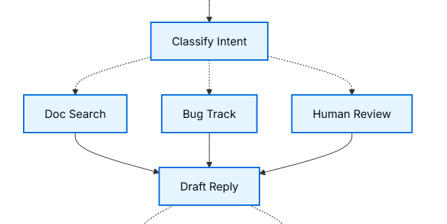

# Tư duy theo LangGraph

> Trang này không dạy cú pháp của một hàm nào cả. Nó dạy **cách nghĩ** khi dựng một agent: chặt quy trình thành các mảnh nhỏ, cho chúng dùng chung một cuốn sổ, rồi để mỗi mảnh tự quyết đi tiếp đâu.
> Ví dụ xuyên suốt là một agent xử lý email hỗ trợ khách hàng. Nền tảng cho các file sâu hơn: [Graph API](../08-graph-api/08-02-graph-api.md), và tổng quan ở [01-01](./01-01-overview.md).

---

## 1. Tổng quan

Ta hoàn toàn có thể viết một agent xử lý email thành **một hàm to**: đọc email, gọi LLM phân loại, tra tài liệu, soạn trả lời, gửi đi — tất cả trong một khối. Nó chạy được. Vấn đề lộ ra lúc mọi thứ không suôn: nếu bước tra tài liệu hỏng ở giữa, ta phải chạy lại từ đầu; nếu cần dừng cho người thật duyệt trước khi gửi, không có chỗ nào để dừng; và khi agent đi nhầm nhánh, ta không có điểm nào để soi xem nó đã quyết gì.

LangGraph chỉ ta dựng theo một hình dạng khác. Chặt quy trình thành các **node** — mỗi node làm đúng một việc. Cho tất cả node dùng chung một **trạng thái** (*state*) để đọc và ghi. Và điểm mấu chốt: **mỗi node tự khai báo nó đi node nào tiếp theo**, thay vì ta viết luồng điều khiển ở bên ngoài.

Cả trang gói trong năm bước lặp đi lặp lại cho mọi agent: 
- (1) chia quy trình thành các node và phác cách chúng nối nhau; 
- (2) xác định mỗi node thuộc loại gì, cần gì để chạy; 
- (3) thiết kế trạng thái; 
- (4) viết từng node thành hàm; 
- (5) ráp các node thành một `graph`. Bốn mục dưới đây là bốn ý cốt lõi rút ra từ năm bước đó.

Hình dạng nhỏ nhất của một graph — mọi mảnh trong đoạn này đều là nguyên thủy của LangGraph:

```python
from langgraph.graph import StateGraph, START, END
from typing import TypedDict

class State(TypedDict):              # trạng thái(state) = cuốn sổ chung, mọi node đọc/ghi vào đây
    email: str
    reply: str | None

def read(state: State) -> dict:      # một node: nhận trạng thái, trả về phần cần cập nhật
    return {"reply": f"Đã đọc: {state['email']}"}   # chỉ trả phần thay đổi, không trả cả state

workflow = StateGraph(State)
workflow.add_node("read", read)             # đăng ký hàm read thành một node tên "read"
workflow.add_edge(START, "read")            # cạnh: vào graph thì chạy "read" trước
workflow.add_edge("read", END)              # chạy xong "read" thì kết thúc
app = workflow.compile()                    # dựng thành thứ chạy được
```

Trang này chạy graph bằng `app.stream_events(...)` (một API streaming, xem [02-04](../../LangChain/02-model-layer/02-04-streaming.md)). Sau khi chạy, cuốn sổ trạng thái ở trạng thái cuối như sau:

**Kết quả** (dựng lại):

```
{'email': 'Quên mật khẩu?', 'reply': 'Đã đọc: Quên mật khẩu?'}   ← node read đã ghi 'reply' vào sổ
```

Đây mới là graph một node đi thẳng. Điều quan trọng thật nằm ở chỗ node biết tự rẽ nhánh — mục 4.

---

## 2. node (`node`) — mảnh nhỏ làm một việc

**Vai trò là gì.** Một hàm to hỏng ở phút thứ 40 thì mất cả 40 phút. Chia thành node nhỏ, hỏng ở đâu chỉ chạy lại từ đầu node đó — vì LangGraph lưu trạng thái tại **ranh giới giữa các node** (chi tiết ở mục 8). Ngoài ra, node nhỏ cho ta chỗ để soi: dừng lại giữa hai node và xem trạng thái lúc đó chứa gì.

**Node là gì.** đó một hàm Python nhận `state` hiện tại và trả về phần cập nhật cho `state`. Không hơn. Hàm `read` ở mục 1 là một node đầy đủ.

**Cách chia — mỗi node một việc.** Trong ví dụ email, quy trình được chặt thành: `read_email` (bóc nội dung email), `classify_intent` (LLM phân loại độ khẩn và chủ đề), `search_documentation` (tra kho tài liệu), `bug_tracking` (tạo ticket lỗi), `draft_response` (soạn nháp trả lời), `human_review` (đẩy cho người duyệt), `send_reply` (gửi đi).

Có một khác biệt đáng để ý giữa các node: một số node **tự quyết đi đâu tiếp** (`classify_intent`, `draft_response`, `human_review` — chúng rẽ nhánh tùy nội dung), số còn lại **luôn đi tới cùng một node kế** (`read_email` luôn sang `classify_intent`, `search_documentation` luôn sang `draft_response`). Phân biệt này quyết định lát nữa ta nối chúng bằng cạnh cứng hay để chúng tự định tuyến (mục 4).

---

## 3. Trạng thái (`state`) — cuốn sổ chung

**Vai trò.** Các node chạy tách rời nhau, không gọi trực tiếp nhau như hàm gọi hàm. Vậy node sau lấy kết quả của node trước ở đâu? Ở trạng thái. Nó là bộ nhớ chung mọi node đọc/ghi — hình dung như cuốn sổ tay agent dùng để ghi lại mọi thứ nó học được và quyết định được trong lúc chạy.

**Cái gì nên vào state.** Không lưu dữ liệu mà node sau không dùng tới. Cũng không lưu thứ tính lại được từ dữ liệu đã có, vì lúc cần hẵng tính, state gọn thì dễ soi hơn. Chỉ lưu thứ node sau cần dùng mà không dựng lại được.

Với agent email: email gốc và thông tin người gửi phải lưu vì mất là không dựng lại được; kết quả phân loại phải lưu vì nhiều node sau đọc tới; kết quả tra cứu và dữ liệu khách hàng nên lưu vì tra lại chậm và tốn lượt gọi API; bản nháp trả lời phải lưu vì phải sống qua bước duyệt mới tới bước gửi.

**Nguyên tắc quan trọng nhất của mục này: lưu dữ liệu thô, đừng lưu chữ đã định dạng.** Trạng thái chỉ chứa dữ liệu gốc — không prompt, không chuỗi đã ghép sẵn, không câu lệnh. Việc ghép prompt để đó, làm ngay trong node lúc cần dùng.

Vì sao tách vậy? Ba lý do cụ thể. Các node khác nhau có thể định dạng *cùng một dữ liệu* theo *cách khác nhau* cho nhu cầu riêng. ta đổi mẫu prompt mà không phải sờ vào cấu trúc trạng thái. Và khi debug, ta thấy đúng dữ liệu thô từng node nhận, không phải một chuỗi đã trộn lẫn khó truy.

Trạng thái của agent email khai báo bằng `TypedDict`:

```python
from typing import TypedDict, Literal

class EmailClassification(TypedDict):
    intent: Literal["question", "bug", "billing", "feature", "complex"]
    urgency: Literal["low", "medium", "high", "critical"]
    topic: str
    summary: str

class EmailAgentState(TypedDict):
    email_content: str                          # email thô — không thể dựng lại về sau
    sender_email: str
    email_id: str
    classification: EmailClassification | None  # kết quả LLM, lưu nguyên dạng dict
    search_results: list[str] | None            # mẩu tài liệu thô, chưa ghép thành prompt
    customer_history: dict | None               # dữ liệu khách thô từ CRM
    draft_response: str | None
    messages: list[str] | None
```

Toàn bộ là dữ liệu thô. Kết quả phân loại của LLM được lưu thẳng thành một dict, không bẻ nhỏ ra từng trường.

**!Note:**: `EmailAgentState` khai bằng `TypedDict`, mà `TypedDict` **không chặn** việc ghi thêm khóa lạ — trong ví dụ, node `bug_tracking` ghi vào một khóa `current_step` không hề có trong khai báo, và node `read_email` trả về danh sách `HumanMessage` trong khi `messages` khai là `list[str]`. Code vẫn chạy trơn, không lỗi, không cảnh báo. Nhưng khóa lệch tên hoặc kiểu lệch schema là loại sai chỉ lộ ra khi một node sau đi tìm đúng khóa đó mà không thấy. Giữ khóa ghi vào đúng khớp với schema.

---

## 4. Định tuyến sống bên trong node (`Command`)

**Vai trò.** Cách thông thường: ta viết một cây `if/else` khổng lồ ở ngoài để điều phối — nếu có vấn đề A thì gọi hàm A, nếu là vấn đề B thì gọi hàm B. Cây đó phình lên theo số nhánh và nằm tách khỏi chỗ ra quyết định, nên đọc luồng thành ra phải nhảy qua nhảy lại. LangGraph lật ngược: **chỗ nào ra quyết định thì chỗ đó khai luôn đi đâu tiếp.**

**Cơ chế.** Một node cần rẽ nhánh thì trả về một `Command` thay vì một dict thường. `Command` gói hai thứ: `update=` (phần ghi vào trạng thái, y như dict thường) và `goto=` (tên node đi tiếp). Và node khai trước những đích nó *có thể* tới bằng gợi ý kiểu `Command[Literal["node_a", "node_b"]]`.

```python
from langgraph.types import Command
from typing import Literal

def classify_intent(state) -> Command[Literal["search_documentation", "human_review", "bug_tracking", "draft_response"]]:
    structured_llm = llm.with_structured_output(EmailClassification)  # ép LLM trả về đúng dict phân loại
    classification = structured_llm.invoke(classification_prompt)     # prompt ghép tại chỗ, không lấy từ state

    if classification['intent'] == 'billing' or classification['urgency'] == 'critical':
        goto = "human_review"                       # việc nhạy cảm → đẩy người duyệt
    elif classification['intent'] in ['question', 'feature']:
        goto = "search_documentation"               # cần tra tài liệu mới trả lời được
    elif classification['intent'] == 'bug':
        goto = "bug_tracking"
    else:
        goto = "draft_response"

    return Command(update={"classification": classification},   # vừa ghi kết quả vào sổ...
                   goto=goto)                                   # ...vừa khai đi node nào tiếp
```



**Kết quả:** vì việc định tuyến nằm trong node, cái `graph` ta ráp ở ngoài **gần như không cần cạnh nào**. ta chỉ khai vài cạnh cứng thật sự cố định (điểm vào, và những node luôn đi tới cùng một chỗ). Toàn bộ nhánh rẽ đã nằm trong các `goto`. Luồng vẫn tường minh và truy được: nhìn gợi ý `Literal[...]` của một node là biết nó có thể đi đâu.

**!Note:** Danh sách trong `Literal[...]` phải liệt kê đủ mọi đích mà `goto` có thể nhận. Thiếu một tên ở đây thì đó là lỗi khai báo lệch với hành vi thật — dạng sai âm thầm, khó lần khi graph lớn.

---

## 5. Bốn loại node — soi mỗi bước cần gì

Trước khi viết một node, xếp nó vào một trong bốn loại. Việc xếp loại không phải hình thức: nó cho ta biết node đó cần **ngữ cảnh gì** và **chiến lược lỗi nào**.

| Loại node | Dùng khi | Cần chuẩn bị gì |
|---|---|---|
| **LLM** | cần hiểu, phân tích, sinh văn bản, hoặc ra quyết định suy luận | ngữ cảnh tĩnh (prompt: danh mục phân loại, quy tắc giọng văn) + ngữ cảnh động (lấy từ state: nội dung email, kết quả phân loại) |
| **Data** | cần lấy thông tin từ nguồn ngoài | tham số truy vấn dựng từ state; chiến lược thử lại; có nên cache không |
| **Action** | cần thực hiện hành động ra bên ngoài (gửi mail, tạo ticket) | thời điểm nào mới được chạy; thử lại thế nào; thường **không** cache vì mỗi lần là một hành động riêng |
| **User input** | cần con người can thiệp | ngữ cảnh để người quyết; định dạng đầu vào mong đợi; điều kiện kích hoạt |

Trong agent email: `classify_intent` và `draft_response` là node LLM; `search_documentation` và tra cứu lịch sử khách là node Data; `send_reply` và `bug_tracking` là node Action; `human_review` là node User input.

Một điểm về cache đáng ghi rõ để khỏi hiểu nhầm: quyết định cache kết quả tra cứu hay không là **việc ở tầng ứng dụng của ta**, không phải tính năng LangGraph cấp sẵn. ta tự cài cache bên trong hàm node theo nhu cầu; framework không quy định chuyện này.

---

## 6. Xử lý lỗi theo từng loại

Không phải lỗi nào cũng xử như nhau. Trang phân ra năm loại, mỗi loại một người "sửa" và một chiến lược riêng:

| Loại lỗi | Ai sửa | Cách xử lý | Dùng khi |
|---|---|---|---|
| Tạm thời (mạng chập, chạm rate limit) | Hệ thống, tự động | `RetryPolicy` (chính sách thử lại) | lỗi thoáng qua, thử lại là thường qua |
| LLM tự gỡ được (tool hỏng, parse lỗi) | Chính LLM | ghi lỗi vào state rồi quay lại node LLM | để LLM đọc được lỗi và tự đổi cách làm |
| Người dùng phải gỡ (thiếu thông tin) | Người dùng | dừng bằng `interrupt()` | cần người nhập mới đi tiếp được |
| Gỡ được sau khi hết lượt thử | Lập trình viên (khai báo) | `error_handler` | chạy nhánh bù/khôi phục sau khi retry cạn |
| Bất ngờ | Lập trình viên | để lỗi nổi lên | lỗi lạ, phải debug — đừng nuốt cái mình không xử được |

Loại đầu — lỗi tạm thời — gắn ngay lúc đăng ký node, chỉ cho node nào gọi ra bên ngoài:

```python
from langgraph.types import RetryPolicy

workflow.add_node(
    "search_documentation",
    search_documentation,
    retry_policy=RetryPolicy(max_attempts=3, initial_interval=1.0)   # thử tối đa 3 lần, giãn dần
)
```

Loại "LLM tự gỡ" khác về bản chất: không thử lại máy móc, mà **ghi thẳng lỗi vào trạng thái rồi `goto` quay về node LLM** để LLM nhìn thấy lỗi và điều chỉnh. Loại "người dùng phải gỡ" dùng `interrupt()` để dừng chờ người nhập — cơ chế dừng/chạy tiếp này có file riêng.

Loại "gỡ được sau khi hết lượt thử" dùng `error_handler` — một hàm chạy *sau khi* retry cạn, để cập nhật state và rẽ sang nhánh bù (ví dụ hoàn tiền khi tính phí lỗi):

```python
from langgraph.errors import NodeError
from langgraph.types import Command, RetryPolicy

def payment_error_handler(state, error: NodeError) -> Command:
    return Command(update={"status": f"compensated: {error.error}"},   # ghi trạng thái đã bù
                   goto="finalize")                                     # rẽ sang nhánh khôi phục

workflow.add_node("charge_payment", charge_payment,
                  retry_policy=RetryPolicy(max_attempts=3, retry_on=ConnectionError),
                  error_handler=payment_error_handler)
```

Chi tiết hãy xem tại [Langgraph docs](https://docs.langchain.com/oss/python/langgraph/thinking-in-langgraph#llm-recoverable)

Xử lý lỗi kiểu này có tác dụng:

- **Tự động phục hồi.** Lỗi mạng hay chạm rate limit thì tự gọi lại, không phiền tới lập trình viên (`RetryPolicy`).
- **Cho AI tự sửa sai.** Ghi lỗi do LLM gây ra vào state để lần sau nó nhìn vào đó mà đổi cách làm (`LLM tự gỡ`).
- **Chờ người dùng đúng lúc.** Tạm dừng để con người nhập thêm thông tin rồi mới chạy tiếp (`interrupt()`).
- **Có phương án dự phòng.** Khi thử lại mãi vẫn hỏng, rẽ sang một nhánh khác để xử lý hậu quả thay vì để app sập (`error_handler`, kiểu saga/bù trừ).

---

## 7. Ráp lại thành graph

Đến bước ráp, cái đẹp của "định tuyến trong node" mới hiện rõ: ta chỉ khai vài cạnh cứng, phần còn lại các node tự lo.

```python
from langgraph.checkpoint.memory import MemorySaver
from langgraph.types import RetryPolicy

workflow = StateGraph(EmailAgentState)

workflow.add_node("read_email", read_email)
workflow.add_node("classify_intent", classify_intent)
workflow.add_node("search_documentation", search_documentation,
                  retry_policy=RetryPolicy(max_attempts=3))   # chỉ node gọi API ngoài mới cần thử lại
workflow.add_node("bug_tracking", bug_tracking)
workflow.add_node("draft_response", draft_response)
workflow.add_node("human_review", human_review)
workflow.add_node("send_reply", send_reply)

workflow.add_edge(START, "read_email")                # cạnh cứng: điểm vào
workflow.add_edge("read_email", "classify_intent")    # read luôn sang classify nên nối cứng
workflow.add_edge("send_reply", END)                  # gửi xong là kết thúc

memory = MemorySaver()                                # checkpointer: nơi lưu trạng thái giữa các lần chạy
app = workflow.compile(checkpointer=memory)           # có checkpointer thì interrupt() mới dừng/tiếp được
```

Chỉ ba cạnh cho một agent bảy node. Mọi nhánh rẽ khác đã nằm trong các `Command(goto=...)` bên trong node.

Vì sao phải có `checkpointer`? Vì `interrupt()` dừng graph để chờ người duyệt, mà muốn dừng rồi *chạy tiếp đúng chỗ cũ* thì phải lưu được toàn bộ trạng thái ở lần dừng. `checkpointer` (nơi lưu trạng thái) làm việc đó. Cơ chế lưu này thuộc file persistence — hiện chưa có trong bộ, cần bổ sung sau.

**!Note:** Bản ghi trong tài liệu lưu ý: nếu chạy graph qua Local Server thì **compile không kèm checkpointer**. Trường hợp đó server tự quản việc lưu trạng thái, truyền thêm checkpointer sẽ xung đột.

Chạy thử với một email khẩn cần người duyệt (rút gọn từ ví dụ của trang):

```python
config = {"configurable": {"thread_id": "customer_123"}}   # thread_id gom mọi trạng thái của một hội thoại
stream = app.stream_events(initial_state, config, version="v3")   # v3 là API streaming bản mới
_ = stream.output                                          # đọc hết để đẩy graph chạy tới lúc dừng
print(f"human review interrupt:{stream.interrupts}")       # graph dừng tại human_review

human_response = Command(resume={"approved": True, "edited_response": "..."})   # gói câu trả lời của người
resumed = app.stream_events(human_response, config, version="v3")   # cùng config → chạy tiếp đúng chỗ cũ
final_state = resumed.output
print("Email sent successfully!")
```

**Kết quả** (dựng lại):

```
human review interrupt:(Interrupt(...),)   ← graph dừng lại, toàn bộ trạng thái đã lưu vào checkpointer
Email sent successfully!                    ← sau khi resume, chạy nốt qua send_reply tới END
```

Điểm hay: graph có thể dừng ở `interrupt()` rồi *nhiều ngày sau* mới chạy tiếp, nhặt lại đúng chỗ đã dừng, nhờ `thread_id` gom hết trạng thái của hội thoại đó lại một mối. Chi tiết vòng dừng/tiếp ở [04-01](../04-human-in-the-loop/04-01-interrupts.md); chi tiết `stream_events` ở [02-04](../../LangChain/02-model-layer/02-04-streaming.md).

---

## 8. Độ mịn của node — Nên chia nhiều node hay chia ít node

> Nếu ứng dụng của ta chỉ cần chạy được theo các mẫu ở trên thì **bỏ qua mục này hoàn toàn**. Đây là phần cân nhắc thiết kế cho người muốn tối ưu, không phải kiến thức bắt buộc.

Nên chia nhỏ. LangGraph lưu checkpoint tại ranh giới giữa các node, và chạy lại sau sự cố thì bắt đầu từ đầu node nơi nó dừng. node càng nhỏ, hỏng thì làm lại càng ít. Ngoài ra mỗi node nhỏ gắn được retry_policy riêng và soi được kết quả trước khi sang bước sau.

Chia nhỏ không làm chậm hơn. Mặc định LangGraph ghi checkpoint ở nền (async), graph chạy tiếp không chờ ghi xong. Cần thì đổi: "exit" chỉ ghi lúc kết thúc, "sync" chặn tới khi ghi xong mới chạy tiếp.

---

## Tham chiếu chéo

- [01-01 Tổng quan](./01-01-overview.md) — bức tranh lớn LangGraph, đọc trước file này
- [02-02 Graph API](../08-graph-api/08-02-graph-api.md) — cú pháp đầy đủ của `StateGraph`, `add_node`, `add_edge`, `Command`
- [04-01 Interrupt](../04-human-in-the-loop/04-01-interrupts.md) — cơ chế `interrupt()` và vòng dừng/chạy tiếp (mục 6 và 7 chỉ nêu, không giảng lại)
- [02-04 Streaming](../../LangChain/02-model-layer/02-04-streaming.md) — `stream_events`, `version="v3"`, `.output`, `.interrupts`
- Persistence (chưa có file): cơ chế `checkpointer` lưu trạng thái — nguồn `docs.langchain.com/oss/python/langgraph/persistence`
- Fault tolerance: vòng đời `RetryPolicy`, `timeout=`, mẫu saga/`error_handler` — nguồn `docs.langchain.com/oss/python/langgraph/fault-tolerance`