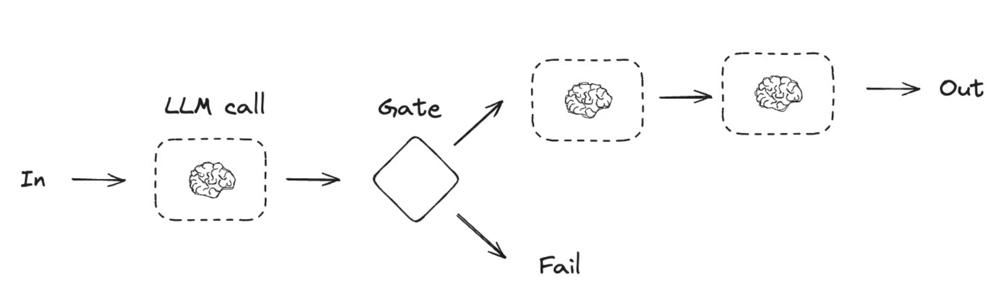

# Workflow và agent

---

## 1. Tổng quan

Ghép nhiều lần gọi LLM thành một ứng dụng có hai kiểu, khác nhau ở đúng một điểm: **ai cầm lái.**

- **Workflow** — bạn viết cứng đường đi, model chạy đúng các bước bạn xếp sẵn. Hợp khi bài toán đoán trước được.
- **Agent** — model tự quyết gọi tool nào, gọi mấy lần, dừng lúc nào. Hợp khi vấn đề lẫn lời giải đều khó đoán.

-> **LangGraph** cho dựng cả hai kiểu mà không phải tự code hạ tầng — lưu trạng thái ([persistence](https://docs.langchain.com/oss/python/langgraph/persistence)), gửi dần kết quả ([streaming](https://docs.langchain.com/oss/python/langgraph/streaming)), gỡ lỗi, triển khai.

> [!note]
> "Workflow" không phải class hay hàm, mà là *cách bố trí* các node. Năm dáng ở mục 3 đều dựng bằng cùng bộ Graph API, chỉ khác topo.

---

## 2. Những công cụ cho LLM

Một LLM trần chỉ nhận chữ, trả chữ. Muốn nó làm được việc trong một hệ thống, gắn thêm ba công cụ :

- **tool** (`bind_tools`) — cho model quyền gọi hàm bạn định nghĩa. 
- **Đầu ra có cấu trúc** (structured output, `with_structured_output`) — ép model trả về đúng một schema (ví dụ Pydantic) thay vì chữ tự do. 
- **Bộ nhớ ngắn hạn** — giữ ngữ cảnh giữa các bước. 


## 3. Năm khuôn workflow
  
### 3.1 Prompt chaining — nối chuỗi, mỗi bước ăn output bước trước

**Khái niệm** : là khi mỗi lệnh gọi LLM xử lý đầu ra của lệnh gọi trước đó. Nó thường được sử dụng để thực hiện các tác vụ được xác định rõ ràng, có thể chia nhỏ thành các bước nhỏ hơn, có thể kiểm chứng được

<div align="center">
  
</div>

**Luồng xử lý**: 

- Đầu vào (`In`) $\rightarrow$ LLM Call: Dữ liệu bắt đầu được đưa vào mô hình LLM để xử lý bước đầu tiên.
- Cổng kiểm tra (`Gate`): Kết quả từ LLM được kiểm định điều kiện:
  - Nếu không đạt yêu cầu $\rightarrow$ Rẽ hướng sang `Fail` (dừng lại hoặc xử lý lỗi).
  - Nếu đạt yêu cầu $\rightarrow$ Tiếp tục chuyển sang các bước tiếp theo.
- Chuỗi xử lý tiếp theo $\rightarrow$ Đầu ra (`Out`): Dữ liệu tiếp tục qua các bước LLM nối tiếp nhau để hoàn thiện và trả về kết quả cuối cùng.
### 3.2 Parallelization — chạy song song

**Khái niệm.** Nhiều lần gọi LLM chạy *đồng thời* trên cùng một đầu vào, mỗi nhánh lo một việc độc lập; xong hết thì một node gộp (`aggregator`) ghép kết quả lại thành một đầu ra.


<div align="center">
  
</div>

**Luồng xử lý**: 

 `In` tỏa vào ba nhánh LLM chạy song song → cả ba cùng đổ về `Aggregator` → `Aggregator` đợi đủ cả ba mới gộp → `Out`.

### 3.3 Routing — phân loại rồi rẽ nhánh

**Khái niệm.** Một node phân loại (`Router`) đọc đầu vào, quyết nó thuộc loại nào, rồi đẩy vào đúng một nhánh xử lý chuyên biệt — mỗi loại một luồng riêng.

<div align="center">
  
</div>

**Luồng xử lý**: `In` vào `Router` → `Router` phân loại → chỉ *một* trong ba nhánh được chọn (mũi tên nét đứt = đường có thể đi) → nhánh đó xử lý → `Out`.

### 3.4 Orchestrator–worker — chia việc động rồi tổng hợp

**Khái niệm.** Một node điều phối (`Orchestrator`) chia đầu vào thành nhiều phần *lúc chạy*, giao mỗi phần cho một worker LLM riêng; xong hết thì node tổng hợp (`Synthesizer`) gộp lại thành một đầu ra.

<div align="center">
  
</div>

**Luồng xử lý**: `In` vào `Orchestrator` → `Orchestrator` cắt việc, tỏa ra các worker chạy song song → cả các worker cùng đổ về `Synthesizer` → `Synthesizer` gộp → `Out`. Số nhánh do orchestrator quyết lúc chạy, không cố định trước.


### 3.5 Evaluator–optimizer — sinh rồi chấm, lặp tới khi đạt

**Khái niệm.** Một node sinh (`Generator`) tạo bản nháp, một node chấm (`Evaluator`) đánh giá; chưa đạt thì trả về cho `Generator` làm lại, đạt thì đi ra.

<div align="center">
  
</div>

**Luồng xử lý**: `In` vào `Generator` → `Evaluator` chấm → đạt thì `Out`; bị `Rejected` thì mũi tên quay ngược về `Generator` sinh lại (kèm nhận xét), lặp tới khi đạt.

---

## 4. Agent — vòng lặp tự quyết

**Khái niệm.** Model tự quyết gọi tool nào, gọi mấy lần, khi nào đủ để trả lời — bạn chỉ giới hạn bộ tool và đặt quy tắc, còn *thứ tự* thì model định. Dùng khi cả vấn đề lẫn lời giải đều không đoán trước được, viết cứng đường đi bất khả.
.

```python
def should_continue(state) -> Literal["tool_node", END]:
    last_message = state["messages"][-1]
    if last_message.tool_calls:                          # model còn đòi gọi tool -> đi chạy tool
        return "tool_node"
    return END                                           # không đòi nữa -> trả lời user, dừng vòng lặp

agent_builder.add_conditional_edges("llm_call", should_continue, ["tool_node", END])
agent_builder.add_edge("tool_node", "llm_call")          # chạy tool xong -> quay lại cho model quyết tiếp
```

Cạnh `"tool_node" -> "llm_call"` chính là chỗ tạo vòng lặp, và điều kiện thoát nằm ở `should_continue`. So với năm dáng workflow: workflow có `END` ở vị trí cố định do bạn đặt; agent để *model* gián tiếp quyết khi nào tới `END`, qua việc còn hay hết `tool_calls`.

**Kết quả** :

```
HumanMessage:  "Add 3 and 4."                            ← câu hỏi của người dùng
AIMessage:     tool_calls=[{name: 'add', args:{a:3,b:4}}] ← model quyết gọi tool add
ToolMessage:   "7"                                        ← tool_node chạy add(3,4), trả 7 về
AIMessage:     "3 cộng 4 bằng 7."                         ← model thấy đủ, không gọi tool nữa -> dừng
```

### 4.1 ToolNode và ToolRuntime

`ToolNode` là node dựng sẵn thay cho phần "chạy tool" tự viết tay ở trên, lo luôn ba việc: chạy nhiều tool song song, bắt lỗi, tiêm trạng thái vào tool.

```python
from langgraph.prebuilt import ToolNode

builder.add_node("tools", ToolNode([search, calculator]))  # một node lo hết việc chạy tool
```

**Đọc dữ liệu ngoài model bằng `ToolRuntime`.** Mặc định tool chỉ nhận đúng các tham số *do model sinh ra*. Nhưng nhiều khi tool cần dữ liệu mà model không nên (và không thể) tự bịa: `user_id` đang đăng nhập, `organization_id` của phiên chạy. Đó là lúc dùng [ToolRuntime](../../LangChain/03-harness/03-02-tools.md) — một tham số tiêm vào, mở đường đọc trạng thái graph và ngữ cảnh theo lần chạy.

```python
@tool
def get_user_info(runtime: ToolRuntime[Context, State]) -> str:
    user_id = runtime.state["user_id"]                   # đọc trạng thái graph (không do model sinh)
    organization_id = runtime.context.organization_id    # đọc giá trị riêng của lần chạy này
    return f"User {user_id} in organization {organization_id}"
```

---

## Tham chiếu chéo

- [01-02 thinking-in-langgraph](./01-02-thinking-in-langgraph.md) — tư duy trạng thái/node làm nền cho mọi dáng ở đây
- [02-02 graph-api](../02-graph-api/02-02-graph-api.md) — cơ chế `StateGraph`, node, cạnh, cạnh điều kiện, reducer cộng dồn; file này chỉ dùng lại, không giảng
- Tools: `https://docs.langchain.com/oss/python/langchain/tools` — chi tiết `@tool`, `ToolRuntime`
- Structured output: `https://docs.langchain.com/oss/python/langchain/structured-output` — chi tiết `with_structured_output`
- Human-in-the-loop / interrupts: `https://docs.langchain.com/oss/python/langgraph/interrupts` — người duyệt thay node chấm ở §3.5
- Streaming: `https://docs.langchain.com/oss/python/langgraph/streaming` — làm rõ `stream_events` và `version="v3"`