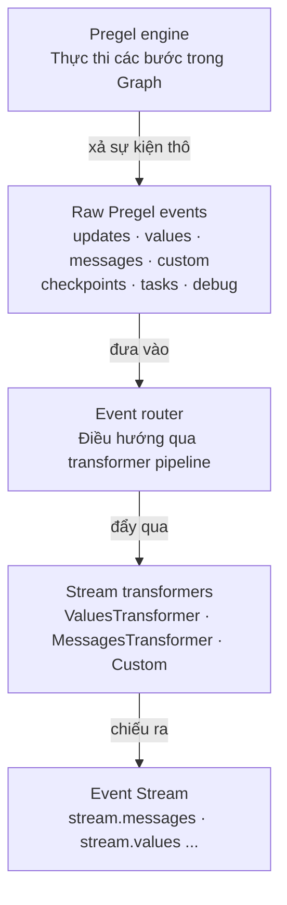

# Event streaming mức graph (`graph.stream_events`)

> Cách LangGraph khuyến nghị để đọc dữ liệu chảy ra từ một lần chạy graph: một luồng sự kiện duy nhất, phơi ra thành nhiều "khung nhìn" (projection) có kiểu rõ ràng, nhiều bên đọc song song không giẫm chân nhau.
> Nó đứng **trên** streaming thô ([03-01](./03-01-streaming.md)); phần tự viết projection nằm ở [07-03](../07-frontend/07-03-custom-stream-channels.md).

---

## 1. Tổng quan

Khi một graph chạy, bên trong nó xảy ra rất nhiều thứ cùng lúc: model nhả token, state cập nhật sau từng bước, subgraph con chạy, tool bắn kết quả, thỉnh thoảng dừng lại chờ người duyệt. Muốn hiện bất cứ thứ nào trong số đó lên giao diện hay ghi log, ta phải lấy được các sự kiện này ra.

Event streaming là lớp làm việc đó. Gọi `graph.stream_events(input, version="v3")`, ta nhận về một **run stream object** — không phải một danh sách sự kiện thô, mà một đối tượng phơi ra nhiều projection có kiểu: `stream.messages` cho chữ của model, `stream.values` cho state, `stream.output` cho kết quả cuối, `stream.subgraphs` cho graph con... Mỗi projection là một cách đọc riêng trên **cùng một luồng sự kiện**.

Khác biệt so với streaming thô ([03-01](./03-01-streaming.md)): ở đó ta chọn `stream_mode` rồi tự bóc dict thô, tự ghép chuỗi namespace, tự khớp tool với message. Event streaming chuẩn hóa hết rồi đưa cho ta các khung nhìn gọi theo tên, đúng kiểu dữ liệu, và cho **nhiều bên đọc đồng thời**.

```python
stream = graph.stream_events(                              # trả về run stream object, không phải list
    {"messages": [{"role": "user", "content": "42 * 17 = ?"}]},
    version="v3",                                          # phiên bản giao thức sự kiện, bắt buộc ghi
)

for message in stream.messages:                            # khung nhìn "chữ của model"
    for token in message.text:                             # message.text lặp được: token một
        print(token, end="", flush=True)                   # end="" để chữ nối liền, không xuống dòng

final_state = stream.output                                # đợi lấy kết quả cuối của cả run
```

**Kết quả in ra** :

```
The                                                        ← token đầu, in ngay khi model vừa nhả
 answer                                                    ← các token nối liền nhau nhờ end=""
 is                                                        ← ...
 714.                                                      ← token cuối của câu trả lời
```

**!Note:** `version="v3"` là phiên bản **giao thức sự kiện**, không phải phiên bản thư viện. Đây là tham số bắt buộc trên mọi lời gọi `stream_events`, kể cả khi resume sau interrupt.

---

## 2. Sơ đồ kiến trúc Event Streaming Pipeline

LangGraph cung cấp sẵn trọn bộ Event Streaming Pipeline này, tự động chuyển dữ liệu thô phức tạp thành các dòng sự kiện sạch sẽ (`stream.messages`, `stream.values`...), nhờ đó ta chỉ cần tập trung viết code ứng dụng mà không tốn công bóc tách dữ liệu thủ công.



**Diễn giải từng chặng:**

| Chặng | Thành phần | Làm gì |
|---|---|---|
| 1 | **Pregel engine** | Trái tim của LangGraph, thực thi các bước trong Graph. |
| 2 | **Raw Pregel events** | Engine xả ra chuỗi sự kiện thô đủ loại. |
| 3 | **Event router** | Tiếp nhận sự kiện thô, điều hướng qua transformer pipeline. |
| 4 | **Stream transformers** | Phân loại: `ValuesTransformer` (state), `MessagesTransformer` (token văn bản), `Custom transformers` (tự viết). |
| 5 | **Event Stream** | Dòng sự kiện đã chiếu, có kiểu rõ ràng, client dễ tiêu thụ. |
---

## 3. Các projection có sẵn — đọc dữ liệu gì bằng cái gì

Đây là bảng tra cứu lõi. Tất cả đều đọc trên cùng một run stream, đọc song song được.

| Projection | Lấy ra cái gì |
|---|---|
| `stream` | Lặp qua **mọi** sự kiện giao thức (mức thô nhất của event streaming). |
| `stream.messages` | Chữ của chat model: token, reasoning, tool-call chunk. |
| `stream.values` | Ảnh chụp state sau từng bước; và đợi giá trị cuối. |
| `stream.output` | Đợi lấy **kết quả cuối** của run. |
| `stream.subgraphs` | Phát hiện và quan sát các graph con lồng nhau. |
| `stream.interrupts` | Xem payload của các điểm dừng chờ người (human-in-the-loop). |
| `stream.interrupted` | Kiểm tra run có đang dừng chờ người nhập hay không. |
| `stream.extensions` | Đọc projection do transformer tự viết tạo ra. |

Cái dùng thường xuyên nhất là `stream.messages` (hiện chữ lên UI) và `stream.output` (lấy kết quả cuối). `stream` thô và `stream.extensions` chỉ cần khi ta có nhu cầu đặc biệt — có thể bỏ qua ở lần đọc đầu.

---

## 4. Cách lấy từng loại dữ liệu

> **Về các khối kết quả in ra.** Trang tài liệu gốc không in kết quả mẫu cho ví dụ nào. Các khối "Kết quả" dưới đây tôi tự dựng lại từ mô tả cấu trúc dữ liệu, gắn nhãn (dựng lại). Cần đối chiếu khi chạy thử.

### 4.1 Lấy chữ của model — `stream.messages`

`stream.messages` mô hình hóa đầu ra của model thành từng **message**, mỗi message có `.text`, `.reasoning`, `.tool_calls`, và metadata.

```python
stream = graph.stream_events(input, version="v3")

for message in stream.messages:
    text = str(message.text)                     # str() gom cả câu; lặp message.text thì được từng token
    usage = message.output.usage_metadata        # số token tiêu thụ, có ở message hoàn chỉnh
    print(text)
    print(usage)
```

`message.text` lặp được trong code đồng bộ: lặp thì ra token-một, `str(...)` thì ra cả câu. Ngoài text còn `message.reasoning` (mảnh suy luận của model) và `message.tool_calls` (mảnh tham số của lời gọi tool).

**!Note:** Nếu cần **text, reasoning và tool-call chunk đúng thứ tự chúng đến**, đừng đọc ba projection riêng rồi tự ghép — thứ tự sẽ sai một cách âm thầm (không lỗi, chỉ lệch nhịp). Phải lặp thẳng sự kiện thô của luồng message để giữ đúng trình tự.

### 4.2 Lấy state và kết quả cuối — `stream.values` + `stream.output`

`stream.values` cho **ảnh chụp toàn bộ state** sau mỗi bước; `stream.output` cho **giá trị cuối cùng**.

```python
stream = graph.stream_events(input, version="v3")

for snapshot in stream.values:                   # mỗi bước graph xong là một ảnh chụp state đầy đủ
    print(snapshot)

final_state = stream.output                       # đợi tới khi run kết thúc, lấy state cuối
```

### 4.3 Quan sát graph con — `stream.subgraphs`

Khi graph có graph con lồng bên trong, `stream.subgraphs` cho ta theo dõi việc của chúng **mà không phải tự bóc chuỗi namespace**.

```python
stream = graph.stream_events(input, version="v3")

for subgraph in stream.subgraphs:
    print(subgraph.graph_name, subgraph.path)     # tên graph con và đường dẫn của nó trong cây
    for message in subgraph.messages:             # mỗi graph con lại có luồng message riêng
        print(message.text)
```

**Kết quả in ra** (dựng lại):

```
researcher ['researcher:6f4d']                    ← graph con tên researcher, đường dẫn một tầng
Searching for company filings...                  ← chữ do model bên trong graph con đó nhả ra
```

### 4.4 Đọc nhiều projection đúng thứ tự đến — `stream.interleave`

Muốn trộn nhiều projection lại và nhận đúng thứ tự thời gian chúng xuất hiện, dùng `stream.interleave(...)` (code đồng bộ):

```python
for name, item in stream.interleave("values", "messages", "subgraphs"):
    if name == "values":
        print(f"[state] keys={list(item)}")
    elif name == "messages":
        print(f"[llm] node={item.node}")
    elif name == "subgraphs":
        print(f"[subgraph] path={item.path}")
```

Mỗi vòng lặp trả về cặp `(name, item)`: `name` cho biết item đến từ projection nào, `item` là dữ liệu của projection đó.

### 4.5 Dừng chờ người và chạy tiếp — interrupt & resume

Khi graph dừng chờ người nhập, kiểm tra `stream.interrupted` và đọc payload ở `stream.interrupts`, rồi chạy tiếp bằng cách **gọi lại** `stream_events(..., version="v3")` với một `Command`.

```python
from langgraph.types import Command

stream = graph.stream_events(input, version="v3")
for message in stream.messages:
    print(message.text)

if stream.interrupted:                             # run có dừng chờ người không
    print(stream.interrupts)                       # xem nó đang hỏi gì

stream = graph.stream_events(                       # chạy tiếp: gọi lại chính stream_events
    Command(resume={"decisions": [{"type": "approve"}]}),
    version="v3",
)
final_state = stream.output
```

**!Note:** Resume chỉ chạy được khi graph được compile kèm **checkpointer** và config mang **thread ID**. Thiếu một trong hai thì không có chỗ để nối lại trạng thái đã dừng — xem [persistence]. Đây là điều kiện của cơ chế dừng/tiếp, không phải của riêng event streaming.

### 4.6 Lấy toàn bộ sự kiện thô — lặp thẳng `stream`

Khi cần luồng sự kiện giao thức thô (không qua projection nào), lặp thẳng đối tượng `stream`:

```python
for event in stream:
    namespace = event["params"]["namespace"]       # đường dẫn tới scope phát ra sự kiện
    print(namespace, event["method"], event["params"]["data"])
```

Mỗi sự kiện là một envelope `ProtocolEvent`. Đây cũng chính là hình dạng mà một transformer nhận trong `process(event)`:

```python
class ProtocolEvent(TypedDict):
    seq: int                    # tăng nghiêm ngặt trong một run — dùng cái này để sắp thứ tự
    method: str                 # tên channel: "messages", "values", "updates", "custom", "tools", "lifecycle"...
    params: ProtocolEventParams


class ProtocolEventParams(TypedDict):
    namespace: list[str]        # đường dẫn "<name>:<runtime_id>" từ graph gốc; [] là gốc
    timestamp: int              # mili-giây đồng hồ thực; có thể lệch, đừng dùng để sắp thứ tự
    data: Any                   # payload tùy channel; hình dạng phụ thuộc method
```

`namespace` là đường đi từ graph gốc tới nơi phát sự kiện. Gốc là mảng rỗng `[]`. Mỗi lần lồng thêm một tầng thì thêm một đoạn `"name:runtime_id"` — ví dụ một tool chạy trong subgraph trông như `["researcher:6f4d", "tools:91ac"]`. Phần trước dấu `:` là tên graph/node ổn định, phần sau là ID sinh ra theo mỗi lần gọi.

**!Note:** Sắp thứ tự sự kiện thì dùng `seq`, đừng dùng `timestamp` — đồng hồ thực có thể trôi, dẫn tới thứ tự sai mà không hề báo lỗi.

---

## 5. Kênh (channel) và vòng đời sự kiện

Mục này chỉ cần khi ta xuống mức sự kiện thô ở [4.6]. Ai chỉ dùng projection có sẵn thì **bỏ qua toàn bộ mục này**.

Sự kiện thô chảy trên các **channel**. Tên channel xuất hiện ở trường `method`; mỗi channel nhả một hình dạng sự kiện riêng.

| Channel | Chứa gì |
|---|---|
| `values` | Ảnh chụp state đầy đủ. |
| `updates` | Delta state theo từng node. |
| `messages` | Đầu ra model theo từng khối nội dung (content block). |
| `tools` | Tool bắt đầu, nhả output, kết thúc, lỗi. |
| `lifecycle` | Đổi trạng thái của run, subgraph, subagent. |
| `checkpoints` | Envelope checkpoint nhẹ, dùng cho rẽ nhánh và time travel. |
| `input` | Yêu cầu và phản hồi nhập liệu của con người. |
| `tasks` | Sự kiện tạo và kết quả của task Pregel. |
| `custom` | Payload người dùng tự định nghĩa từ trong code graph. |
| `custom:<name>` | Đầu ra của stream transformer tự viết. |

Các projection có kiểu ở mục 3 chính là được dựng từ những channel này. Ba channel đáng nhớ vì có trạng thái sự kiện riêng:

**`messages`** — mô hình đầu ra thành content block, trường `event` là một trong: `message-start`, `content-block-start`, `content-block-delta`, `content-block-finish`, `message-finish`. Mỗi khối có ranh giới rõ: mở → nhả delta → đóng, xong mới tới khối kế. Nhờ vậy token, khối reasoning, khối tool-call, nội dung đa phương thức đều tường minh mà không cần format riêng của từng nhà cung cấp. `message-finish` có thể kèm số token.

**`tools`** — trường `event` là một trong: `tool-started`, `tool-output-delta`, `tool-finished`, `tool-error`. Các sự kiện tool được khớp với nhau bằng **tool call ID**, nên một lần chạy tool có thể nối ngược về đúng khối tool-call đã sinh ra nó bên channel `messages`.

**`lifecycle`** — trường `event` là một trong: `started`, `running`, `completed`, `failed`, `interrupted`. Ngoài `event`, dữ liệu có thể kèm `graph_name`, `error`, và `cause` — cho biết vì sao một scope con khởi động (do tool cha gọi, do fan-out, do chuyển cạnh).

---

## 6. Tự dựng projection riêng

Khi các projection có sẵn không khớp hình dạng ứng dụng cần, ta viết **stream transformer** của riêng mình. Transformer quan sát sự kiện giao thức, giữ state riêng, và phơi ra khung nhìn dẫn xuất — ví dụ tổng số token, hoạt động tool, tiến độ, artifact. Projection tự viết xuất hiện dưới `stream.extensions`.

Bản thân các projection có sẵn (`stream.messages`, `stream.values`...) cũng chính là transformer dùng đúng cơ chế này. LangGraph còn có sẵn `ToolCallTransformer` (`from langgraph.prebuilt import ToolCallTransformer`) — đăng ký nó để có `stream.tool_calls` trên một `StateGraph` thường.

Đăng ký transformer có hai chỗ: truyền vào lúc gọi (`stream_events(..., transformers=[...])`) để thử nghiệm cục bộ, hoặc compile thẳng vào graph (`builder.compile(transformers=[...])`) khi muốn mọi run đều sinh projection đó.

Cơ chế đầy đủ — interface `StreamTransformer` (`init` / `process` / `finalize` / `fail`), `StreamChannel` có tên và không tên, `required_stream_modes`, cách channel đẩy giá trị vào luồng chính — nằm ở [07-03 Custom stream channels](../07-frontend/07-03-custom-stream-channels.md). Chỗ này chỉ nêu tên để không giẫm lên file đó.

---

## Tham chiếu chéo

- [03-01 Streaming](./03-01-streaming.md) — tầng dưới của ngăn xếp: sự kiện thô theo `stream_mode`. Event streaming đứng trên tầng này.
- [07-03 Custom stream channels](../07-frontend/07-03-custom-stream-channels.md) — chi tiết cơ chế transformer và `StreamChannel` mà mục 6 chỉ nêu tên.
- Trang tài liệu gốc: `https://docs.langchain.com/oss/python/langgraph/event-streaming`
- Sản phẩm liên quan (tài liệu riêng, không thuộc phạm vi file này): LangChain agent streaming, Deep Agents streaming, LangSmith Streaming API cho graph deploy sau Agent Server.